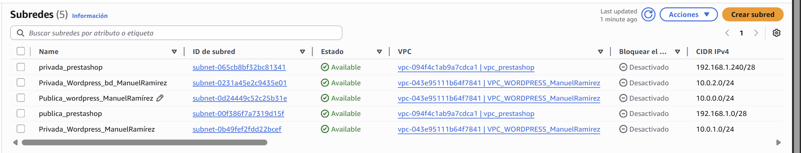
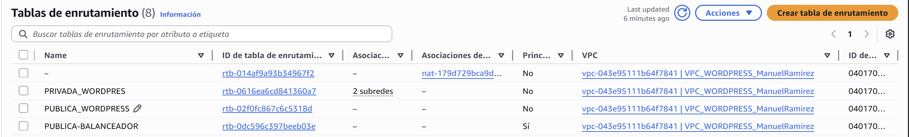
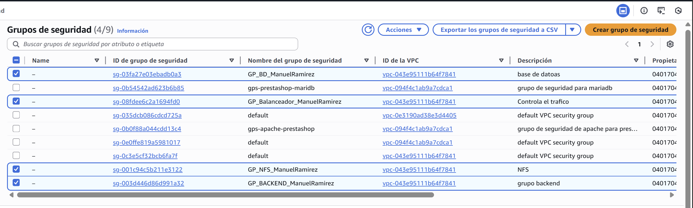
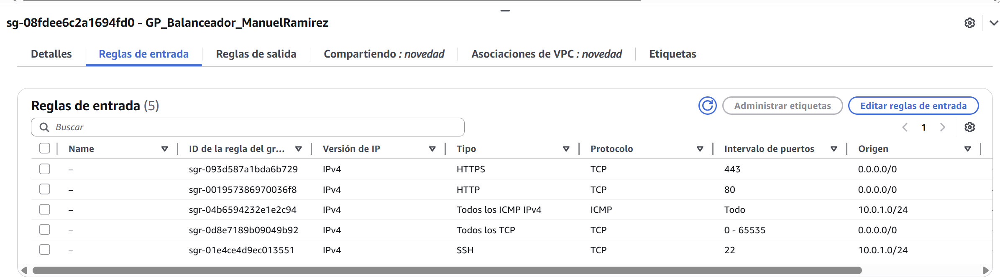
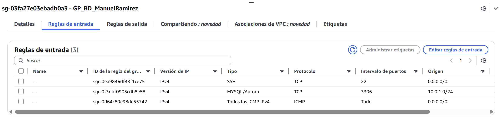

# Despliegue WordPress en AWS – Documento Técnico


## Índice
1. Introducción  
2. Arquitectura  
   2.1 Capas  
   2.2 Reglas de conectividad  
3. Seguridad  
   3.1 Grupos de seguridad  
   3.2 ACLs  
4. Aprovisionamiento (scripts Bash)  
   4.1 Balanceador  
   4.2 NFS  
   4.3 Webs  
   4.4 Base de datos  
5. Dominio y HTTPS   
6. Acceso

---

# 1. Introducción
**Objetivo:** Desplegar WordPress en alta disponibilidad y escalable sobre AWS, siguiendo una arquitectura en tres capas con separación de responsabilidades, seguridad por grupos de seguridad y ACLs, y aprovisionamiento automático mediante scripts Bash.  
**Alcance:** Se publica un sitio HTTPS bajo un dominio del alumno, balanceado con Apache, servido por dos backends que comparten contenido vía NFS y conectado a una base de datos MariaDB/MySQL en red privada.

---

# 2. Arquitectura

### Capas
- **Capa 1 (Pública):** Balanceador Apache (`BalanceadorManuel`).
- **Capa 2 (Privada):** Dos servidores Apache (`Web1Manuel`, `Web2Manuel`) + Servidor NFS (`NFSManuel`).
- **Capa 3 (Privada):** Servidor MariaDB/MySQL (`DBManuel`).

### Reglas de conectividad
- Acceso externo solo a Capa 1.
- Capa 1 no conecta directamente con Capa 3.
- Capa 2 conecta con Capa 3.

---

# 3. Seguridad

### Grupos de Seguridad
| Grupo          | Puertos     | Origen          |
|----------------|-------------|-----------------|
| SG-Balanceador | 80, 443     | Internet        |
| SG-Web         | 80          | SG-Balanceador  |
| SG-NFS         | 2049, 111   | SG-Web          |
| SG-DB          | 3306        | SG-Web          |

### ACLs
- Bloquear tráfico Capa 1 → Capa 3.
- Permitir Capa 1 → Capa 2.
- Permitir Capa 2 → Capa 3.

---

# 4. Aprovisionamiento (Script Bash)

Balanceador: ``

```bash
<VirtualHost *:80>
    ServerName manuelraws.myddns.me
    Redirect permanent / https://manuelraws.myddns.me/
</VirtualHost>
EOF

sudo tee /etc/apache2/sites-available/load-balancer-ssl.conf > /dev/null <<EOF
<IfModule mod_ssl.c>
<VirtualHost *:443>
    ServerName manuelraws.myddns.me

    SSLEngine On
    SSLCertificateFile /etc/letsencrypt/live/manuelraws.myddns.me/fullchain.pem
    SSLCertificateKeyFile /etc/letsencrypt/live/manuelraws.myddns.me/privkey.pem

    <Proxy "balancer://mycluster">
        ProxySet stickysession=JSESSIONID|ROUTEID
        BalancerMember http://10.0.1.26:80
        BalancerMember http://10.0.1.61:80
    </Proxy>

    ProxyPass "/" "balancer://mycluster/"
    ProxyPassReverse "/" "balancer://mycluster/"
</VirtualHost>
</IfModule>
EOF

sudo a2dissite 000-default.conf
sudo a2ensite load-balancer.conf
sudo a2ensite load-balancer-ssl.conf
sudo systemctl reload apache2
ssh -i "vockey.pem" admin@100.30.149.125
```

NFS: ``

```bash
#!/bin/bash
set -e
sudo hostnamectl set-hostname NFSmanuelraws
sudo apt update
sudo apt install nfs-common apache2 php libapache2-mod-php php-mysql php-curl php-gd php-xml php-mbstring php-xmlrpc php-zip php-soap php-intl -y

sudo mkdir -p /nfs/general

sudo mount 10.0.1.100:/var/nfs/general /nfs/general
echo "10.0.1.100:/var/nfs/general  /nfs/general  nfs _netdev,auto,nofail,noatime,nolock,intr,tcp,actimeo=1800 0 0" | sudo tee -a /etc/fstab

sudo cp /etc/apache2/sites-available/000-default.conf /etc/apache2/sites-available/wordpress.conf

sudo tee /etc/apache2/sites-available/wordpress.conf > /dev/null <<EOF
<VirtualHost *:80>
    ServerName https://manuelraws.myddns.me
    DocumentRoot /nfs/general/wordpress/

    <Directory /nfs/general/wordpress>
        Options +FollowSymlinks
        AllowOverride All
        Require all granted
    </Directory>
</VirtualHost>
EOF

sudo a2dissite 000-default.conf
sudo a2ensite wordpress.conf
sudo systemctl reload apache2
```

WEB's: ``

```bash

#!/bin/bash
set -e
sudo hostnamectl set-hostname WEBmanuelramirez

sudo apt update
sudo apt install nfs-common apache2 php libapache2-mod-php php-mysql php-curl php-gd php-xml php-mbstring -y

sudo mkdir -p /nfs/general

sudo mount 10.0.1.100:/var/nfs/general /nfs/general
echo "10.0.1.100:/var/nfs/general  /nfs/general  nfs _netdev,auto,nofail,noatime,nolock,intr,tcp,actimeo=1800 0 0" | sudo tee -a /etc/fstab

sudo cp /etc/apache2/sites-available/000-default.conf /etc/apache2/sites-available/wordpress.conf

sudo tee /etc/apache2/sites-available/wordpress.conf > /dev/null <<EOF
<VirtualHost *:80>
    ServerName https://manuelraws.myddns.me
    DocumentRoot /nfs/general/wordpress/

    <Directory /nfs/general/wordpress>
        Options +FollowSymlinks
        AllowOverride All
        Require all granted
    </Directory>
</VirtualHost>
EOF

sudo a2dissite 000-default.conf
sudo a2ensite wordpress.conf
sudo systemctl reload apache2
```
Data Base: ``

```bash
#!/bin/bash
set -e

# Cambiar hostname
sudo hostnamectl set-hostname DBmanuelrwordpress

# Instalar MariaDB
sudo apt update
sudo apt install mariadb-server -y

sudo mysql <<EOF
CREATE DATABASE manuelrwordpress DEFAULT CHARACTER SET utf8 COLLATE utf8_unicode_ci;

CREATE USER 'manuelr'@'10.0.1.61' IDENTIFIED BY 'abcd';
GRANT ALL PRIVILEGES ON manuelrwordpress.* TO 'manuelr'@'10.0.1.61';

CREATE USER 'manuelr'@'10.0.1.26' IDENTIFIED BY 'abcd';
GRANT ALL PRIVILEGES ON manuelrwordpress.* TO 'manuelr'@'10.0.1.26';

FLUSH PRIVILEGES;
EOF

sudo sed -i 's/^bind-address.*/bind-address = 10.0.2.244/' /etc/mysql/mariadb.conf.d/50-server.cnf

sudo systemctl restart mariadb
```
# 🏗️ Despliegue de Infraestructura AWS — Paso a Paso con Capturas
Este documento presenta todas las fases de construcción de la infraestructura en AWS, acompañadas de capturas reales de cada paso:

- Creación de VPC  
- Subredes  
- Internet Gateway  
- NAT Gateway  
- Tablas de rutas  
- Security Groups  
- Instancias EC2  
- Comprobaciones finales  

---

## 📦 1. Crear la VPC
**1.1 Acceder al servicio VPC**  
📌 Navega en AWS → VPC → Tus VPCs → "Boton Naranja" Crear VPC  
*Descripción de la imagen*


**1.2 Configurar la nueva VPC**  
- Nombre: vcp-Wordpress-ManuelRamirez
- IPv4 CIDR: 10.0.0.0/16  
- Tenancy: Default  
*Descripción de la imagen*

---

## 🌐 2. Crear Subredes
**2.1 Subred Pública 1 (Zona A)**  
- Nombre: Publica_wordpress_ManuelRamírez  
- CIDR: 10.0.0.0/24  
- AZ: eu-west-1a

  **2.2 Subred Privada 1 (Zona B)**  
- Nombre: Privada_wordpress_ManuelRamírez
- CIDR: 10.0.1.0/24  
- AZ: eu-west-1b  

**2.3 Subred Privada 2 (Base de datos)**  
- Nombre: Privada_wordpress_bd_ManuelRamírez  
- CIDR: 10.0.2.0/24  
- AZ: eu-west-1a
- 


---
## 🌍 3. Crear Internet Gateway
**3.1 Crear el IGW**  
VPC → Internet Gateways → crear Internet Gateway  
**3.2 Asociarlo a la VPC**  
Seleccionar IGW → Acciones → Conectar to VPC  
*Descripción de la imagen*


---

## 🔄 4. Crear NAT Gateway (opcional para BD privada)
**4.1 Crear Elastic IP**  
EC2 → Redes & Seguridad → IPs Elasticas  
*Descripción de la imagen*


**4.2 Crear NAT Gateway**  
VPC → NAT Gateways → Crear NAT Gateway  
- Subred: gateway_wordpress_manuelr  
- Elastic IP: creado antes  
*Descripción de la imagen*


---

## 🚦 5. Tablas de Rutas
**5.1 Tabla de rutas pública**  
Ruta: 0.0.0.0/0 → IGW  
**5.2 Tabla de rutas privada (para BD)**  
Ruta: 0.0.0.0/0 → NAT Gateway  
*Descripción de la imagen*


---

## 🔐 6. Crear Security Groups


**6.1 GP-BAL (Balanceador)**  
Reglas de entrada:  
- 80 (HTTP) → 0.0.0.0/0  
- 443 (HTTPS) → 0.0.0.0/0  
- 22 (SSH) → Tu IP  
*Descripción de la imagen*


**6.2 GP-WEB (Web1 y Web2)**  
Reglas:  
- HTTP 80 → SG-BAL  
- NFS 2049 → SG-NFS  
- MySQL 3306 → SG-DB  
*Descripción de la imagen*


**6.3 GP-DB (MariaDB)**  
Reglas:  
- 3306 → GP-WEB  
*Descripción de la imagen*


**6.4 GP-NFS**  
Reglas:  
- 2049 → GP-WEB  
*Descripción de la imagen*

---

## 🖥️ 7. Crear las instancias EC2
**7.1 Instancia del Balanceador**  
- AMI: debian  
- Tipo: t2.micro  
- Subred: Pública  
- SG: GP-BAL  
- Script: balanceador.sh  
*Descripción de la imagen*


**7.2 Instancias Web (WEB1 / WEB2)**  
- AMI: debian  
- Tipo: t2.micro  
- Subred: PrivadaA  
- SG: SG-WEB  
- Script: web.sh  
*Descripción de la imagen*


**7.3 Instancia de la Base de Datos**  
- AMI: debian  
- Subred: PrivadaB  
- SG: SG-DB  
- Script: db.sh  
*Descripción de la imagen*


**7.4 Instancia del Servidor NFS**  
- AMI: debian  
- Subred: PrivadaA  
- SG: SG-NFS  
- Script: nfs.sh  
*Descripción de la imagen*

---

## 🧪 8. Pruebas Finales
**8.1 Comprobar el balanceo**  
Acceder varias veces al dominio:  
*Descripción de la imagen*


---

# 🌐 Mi página web
[https://manuelraws.myddns.me](https://manuelraws.myddns.me)

---

### Realizado por: Manuel Ramírez Rodríguez.
